# Lab 1 - Getting Internal data with Azure Data Factory and the integration Runtime

## Introduction

During this lab we will deploy the infrastructure as shown below. This includes a pretend data centre with database server on a network, behind a firewall.

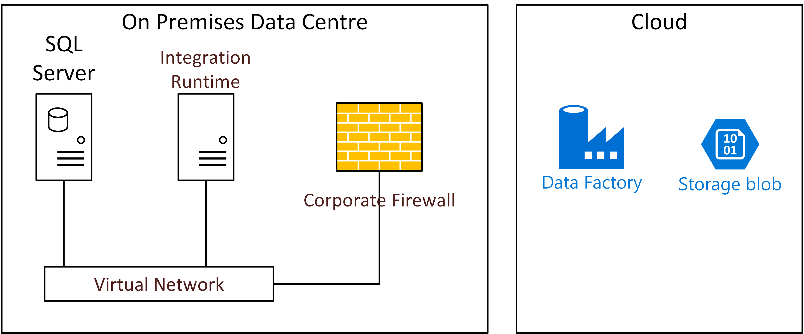

Once configured, an "integration runtime" component will send data securely outwards through the firewall to Azure Data Factory, which will process and store the data in Blob Storage. The data will be queried from the SQL Server via the integration runtime.

# Setup

## Infrastructure

Once you have logged in successfully to your subscription [go here](https://github.com/davedoesdemos/DataLakeInADay/blob/master/infrastructure/readme.md) to deploy the initial infrastructure for the workshop. This includes:
* A Virtual network to represent your data centre network
* An empty SQL Server
* A blank Windows server for the integration runtime
* An empty storage account which will be our data lake
* A blank Data Factory

The username for all servers is **demogod** and you will choose your password when you click the deploy button [here](https://github.com/davedoesdemos/DataLakeInADay/blob/master/infrastructure/readme.md)

## SQL Data

We need to set up some demo data for the workshop. This will simply involve loading a SQL script in SQL Server. Browse to the server (sql-*uniquestring*)  in the Azure portal and click the Connect button to open an RDP session. When prompted, log into the SQL Server using the username **demogod** and your password. Once logged in, open SQL Server Management Studio and connect to the local server. You won't be able to connect directly from your system since there is a firewall in place, as there would be on a corporate network. Click New Query in the interface to start a new query.

Copy the sql script from [this link](https://raw.githubusercontent.com/davedoesdemos/DataLakeInADay/master/data/salesdata/createDatabase.sql) by selecting all and pressing ctrl+c. Paste this text into the query window on the virtual machine (this may take a few seconds so be patient). Press the execute button and wait for it to complete, this may take a few seconds.

You will now have an example sales database.

## Storage Containers

Next we need to create the containers on our data lake. Here we'll be using Blob Storage, but you may use Azure Data Lake Storage Gen1 or Gen2 in a real scenario. For what we're doing here the process is almost the same. In the Azure Portal browse for your storage account (datastore-*uniquestring*). Click Blobs

Now click +Container at the top to create a new container

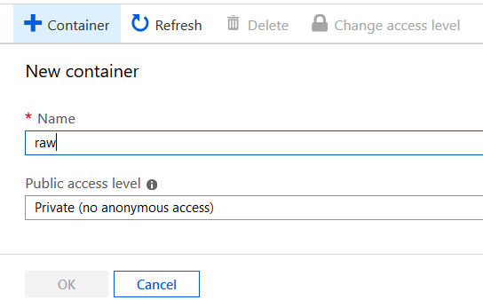

Select Private (no anonymous access) and give the container a name of "raw". Click OK and repeat the process to create a new container named "model"

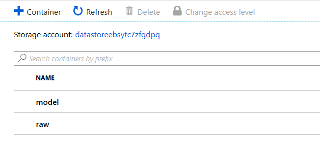

## Self Hosted Integration Runtime

Log into the integration runtime server (ir-*uniquestring*) using the username **demogod** and your password.

In Server Manager, click Local Server then disable IE Enhanced Security Configuration for administrators by clicking the word on next to the setting.

Now open Internet explorer and download the runtime from [https://www.microsoft.com/download/details.aspx?id=39717](https://www.microsoft.com/download/details.aspx?id=39717)

Double click the installer then Choose your language and click Next

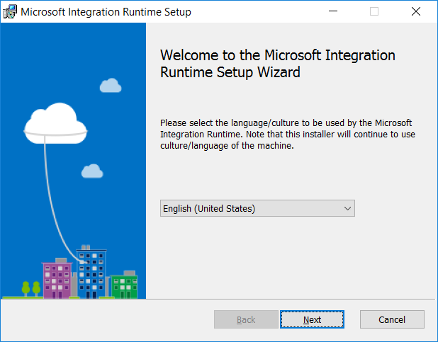

Agree to the terms and click Next

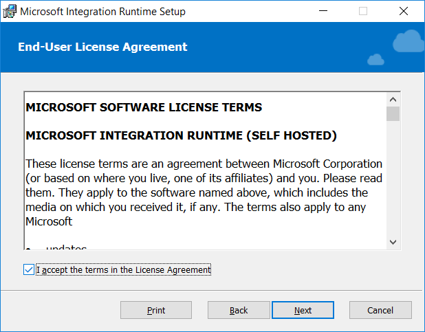

Choose an install location (default is fine) and click Next

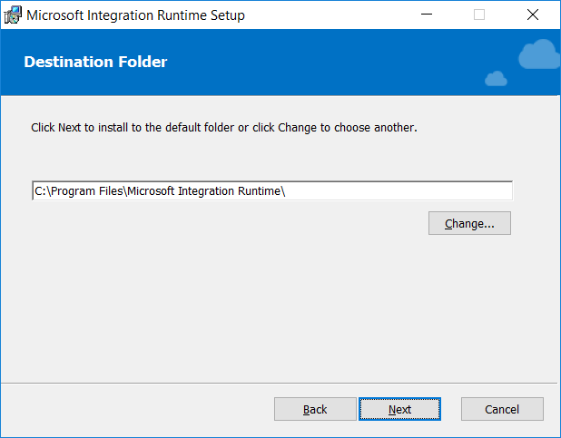

Click Install

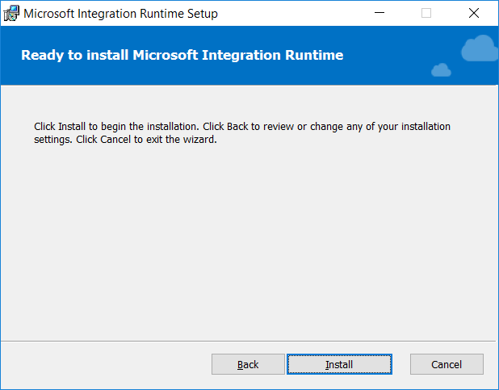

The installer will continue and install the software

Click Finish

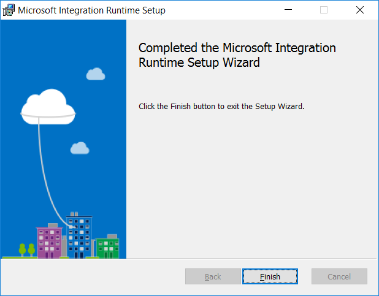

The installer will then launch the configuration manager. Here you can register the integration runtime with your data factory

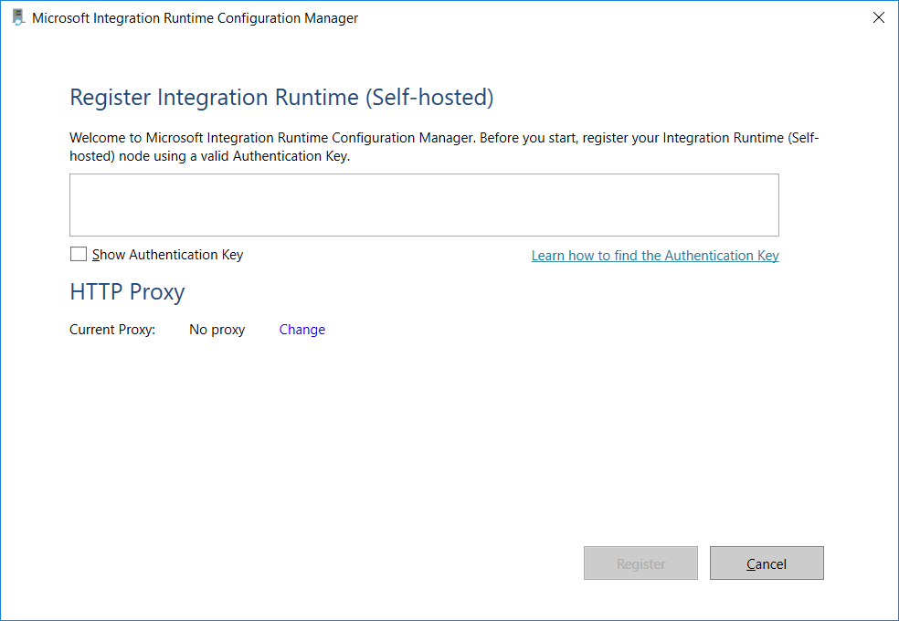

Browse to your data factory in the Azure Portal and click Author and Monitor

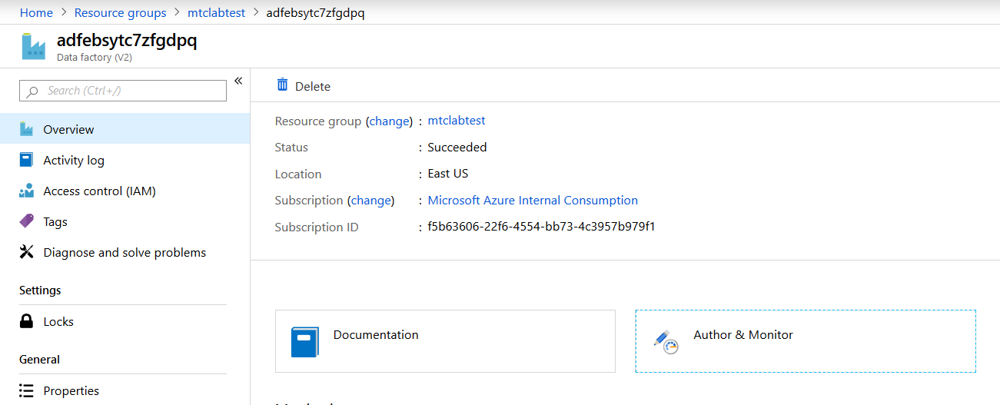

Next, click on the pencil icon on the left of the Data Factory screen to enter the designer. Next, click Connections at the bottom left of your screen and then Integration Runtimes. Click the New button

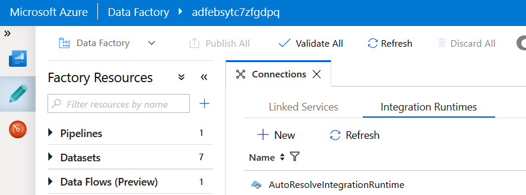

Select "Perform data movement and dispatch activities to external computes." and click Next

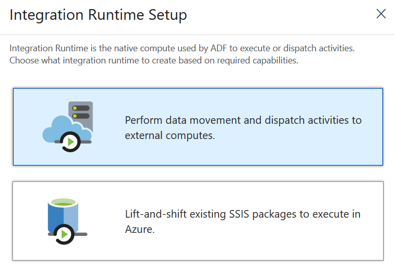

Select "Self Hosted" and click Next

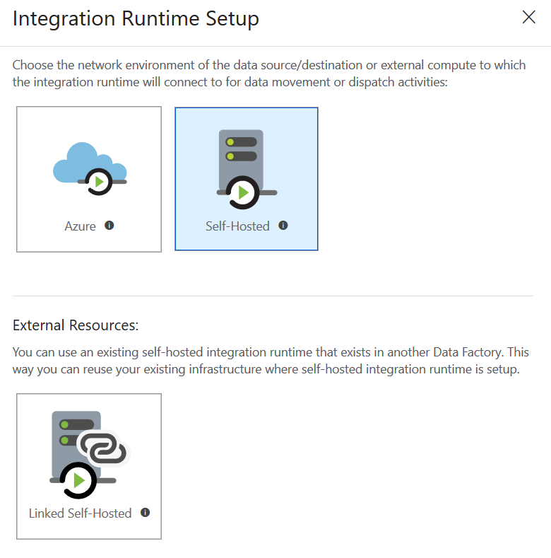

Give the connection a name and description and then click Next

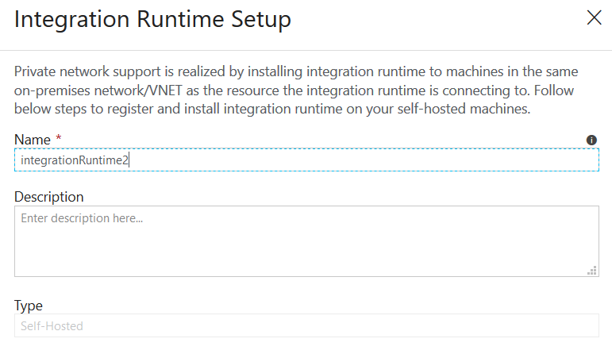

Copy one of the secure keys

Paste the key into the configuration manager window and click Register to complete setup

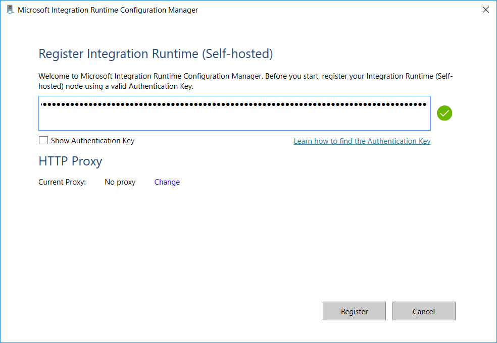

Once it's registered click Finish and close the remote desktop session

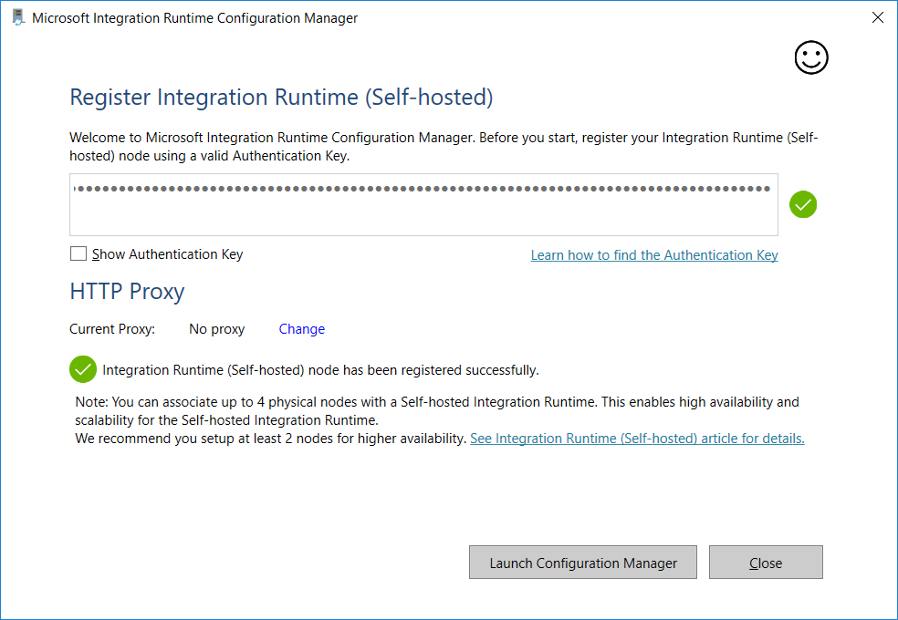

Click refresh in the Azure Data Factory interface and ensure that the new connection shows as connected.

## Data Factory Connections

Now we need to create two connections in Data Factory. One is for SQL Server, and the other is for Blob Storage.

## Data Factory Datasets

## Data Factory Pipeline

