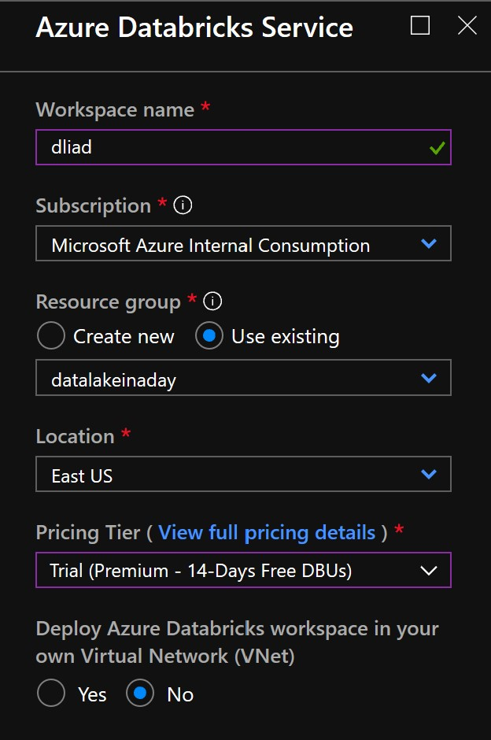
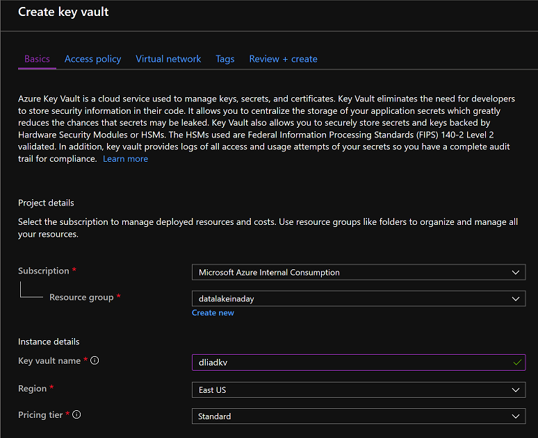
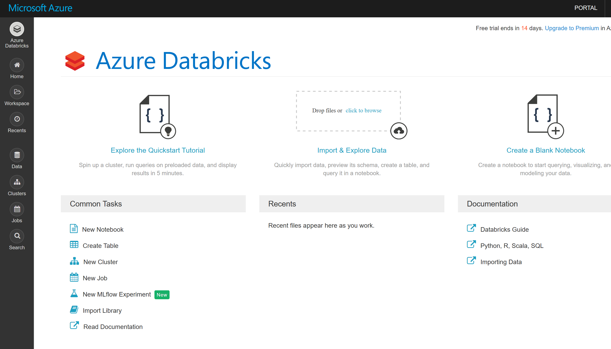
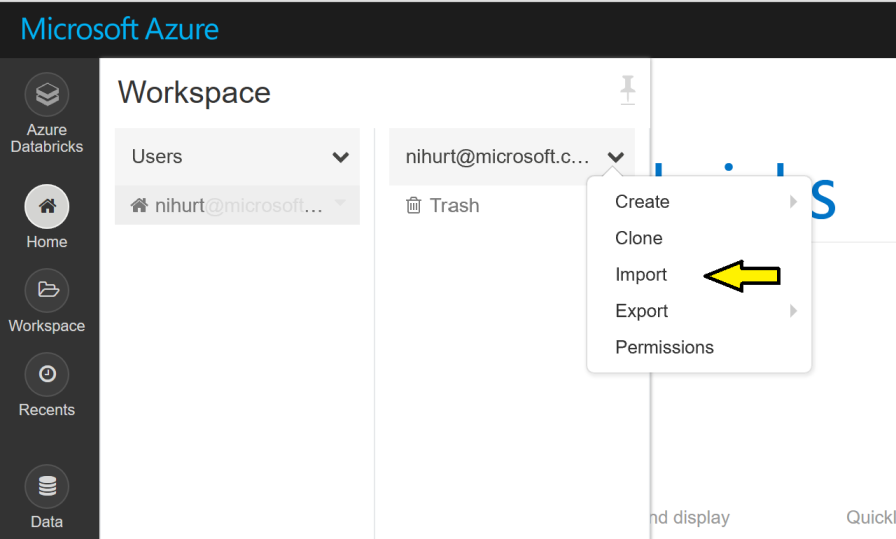

# Lab 3 - Process data using Databricks

## Introduction

In this lab we will transform some of our data using Databricks. This will be achieved running SparkSQL commands in an interactive notebook environment. 

To get started, first create a Databricks workspace in the East US region. Make use of the trial pricing tier. 

Note you are only billed for the time your cluster is running, and you can use the pricing calculator to get an idea of costs. Essentially though you’re paying for the underyling VMs (which are provisioned in an automatically created resource group) and DBUs which are processing units per hour. If you take the free trial, you will only pay for the VMs.
 
You will also need an Azure Key Vault to store secrets. Create a key vault as shown in the diagram below.

## Accessing ADLS from Databricks

Using [Azure Data Lake Storage with Databricks](https://docs.databricks.com/spark/latest/data-sources/azure/azure-datalake-gen2.html#azure-data-lake-storage-gen2) requires a service principal with delegated permissions. Start by creating a [Gen2 storage account](https://docs.microsoft.com/en-us/azure/storage/blobs/data-lake-storage-quickstart-create-account) with the [hierarchical namespace](https://docs.microsoft.com/en-us/azure/storage/blobs/data-lake-storage-namespace) enabled. Make note of the keys. Then follow the steps to create a service principal by registering an application and then assigning the “Storage Blob Data Contributor” role to the service principal (the registered application) at the level of the resource i.e. in the access control of the data lake storage account. 

By now your Databricks workspace should be ready, find the resource and click Launch Workspace. A new tab will open and the Databricks workspace landing page will be displayed. You may be prompted for your Azure credentials again.

Next import the notebooks required for this lab. Click on the Home icon, and click on the drop menu next to your username to reveal the import option as shown below. 

Import from the following archive: 

https://github.com/hurtn/DataLakeInADay/blob/master/Lab3a/DataLakeInADay.dbc

If successful you will notice a new folder entitled DataLakeInADay appear, which contains a set of notebooks and some sub-folders.

Before proceeding any further, let's configure the Key Vault provisioned earlier. Navigate to this resource, open the Secrets blade and click Generate/Import. Enter a name for the secret associated with the service principle created earlier.

## Secret Scope
https://westus.azuredatabricks.net#secrets/createScope

# Next

Now you can go on to [Lab 4](../Lab4/Lab4.md)
