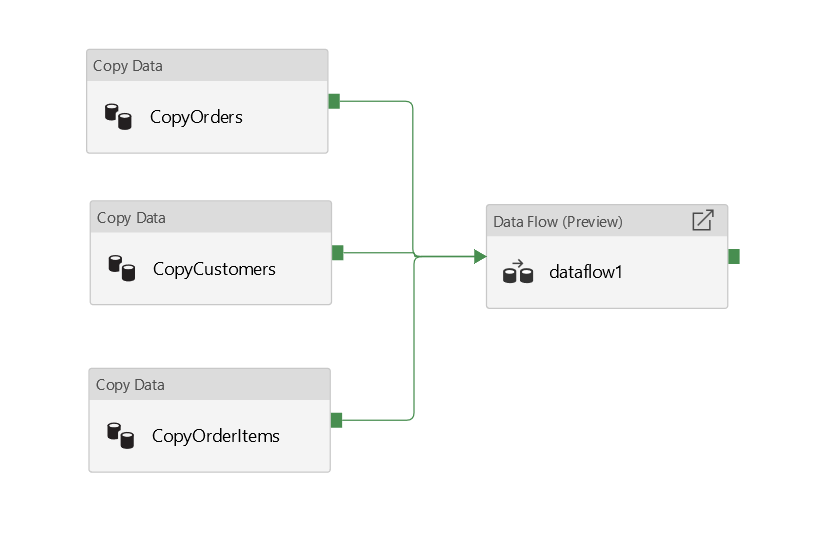
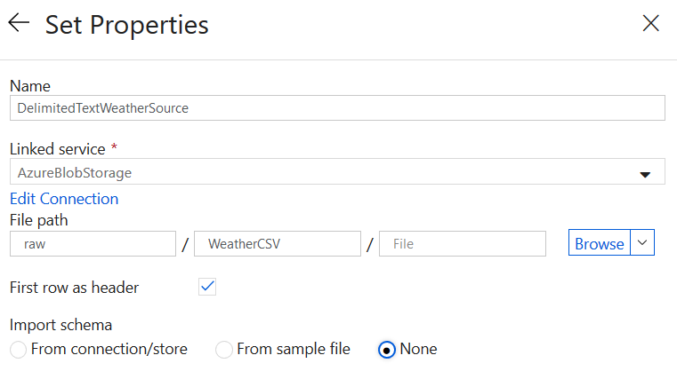
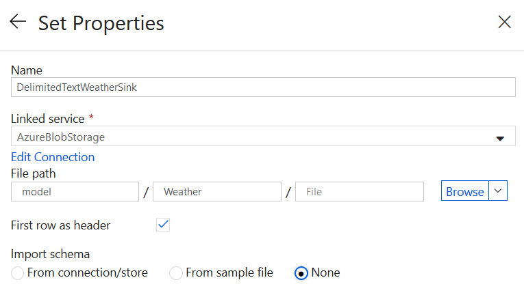

# Lab 3 - Process data using Mapping Data Flows

## Introduction

In this lab we will transform some of our data. We'll consolidate the weather data to a single table, and we'll remap some of the other tables. Usually, this would all be done in a single pipeline. You can see below how this would be done by connecting the three data copy operations to the the next action with the green arrows (drag the green square on the right of an action to do this). Here, though, we'll create a separate prep pipeline which will allow us to manually trigger the job without re-running all of the tumbling window jobs as we did before.

# Setup

## Weather Data

First up we'll look at weather data. Since you will only have a single day of weather data we'll start by uploading some more sample data. Download the [Azure Storage Explorer](https://azure.microsoft.com/en-gb/features/storage-explorer/) and install it. Then download the [Sample Weather Data](https://github.com/davedoesdemos/DataLakeInADay/raw/master/data/weatherdata/SampleWeatherData.zip) and unzip somewhere on your system. Then use the storage explorer to upload the files into your storage account under /raw/WeatherCSV alongside your other data.

Don't wait for this to complete, just let the upload happen in the background.

## Data Prep Pipeline

In Data Factory, create a new pipeline and name it PipelineDataPrep. Add a Copy Data action to this and call that CopyWeatherData. On the source tab, click New to create a new dataset. Select Blob Storage and then your AzureBlobStorage linked service. Name this dataset DelimitedTextWeatherSource and then select raw/weatherCSV as the folder and tick first row as header. Select no schema and click finish.

Repeat this process on the Sink tab but use the name DelimitedTextWeatherSink and change the path to model/Weather

Back on the sync tab of the copy activity, change the copy behaviour to "merge files" and the extension to .csv

# Next

Now you can go on to [Lab 4](../Lab4/Lab4.md)